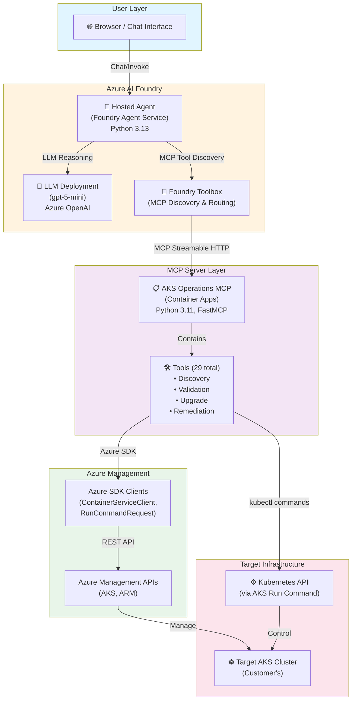
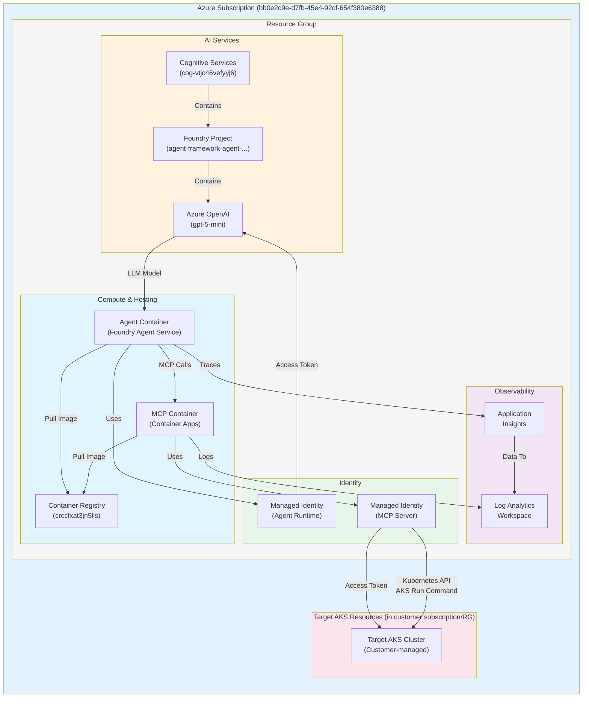
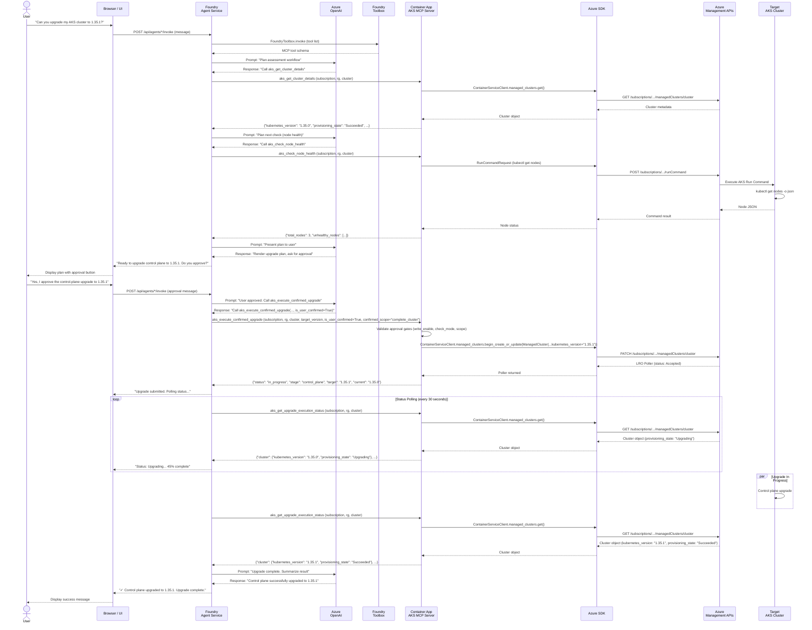
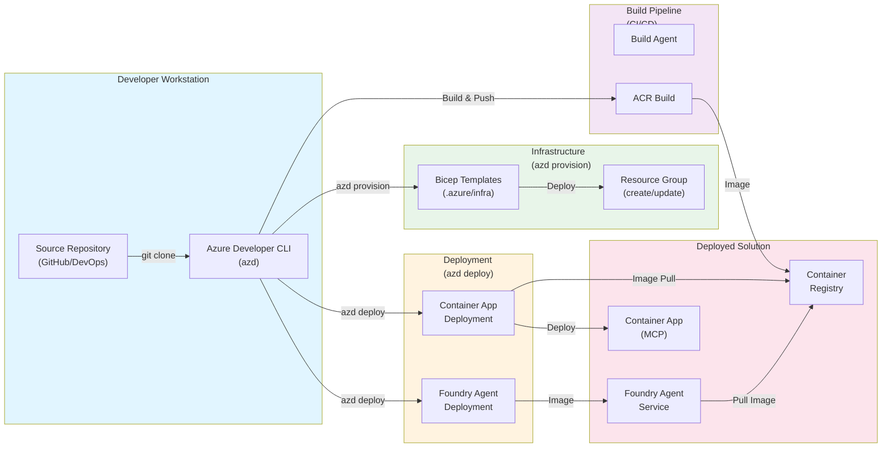
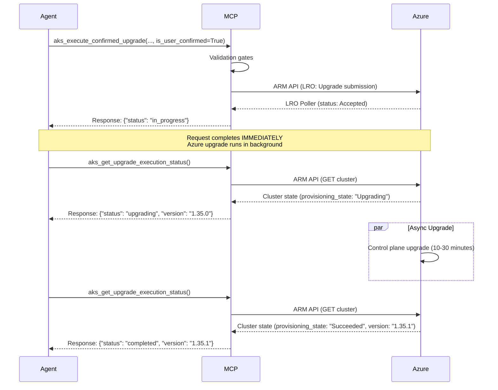
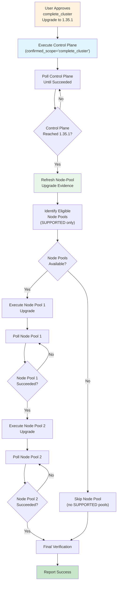
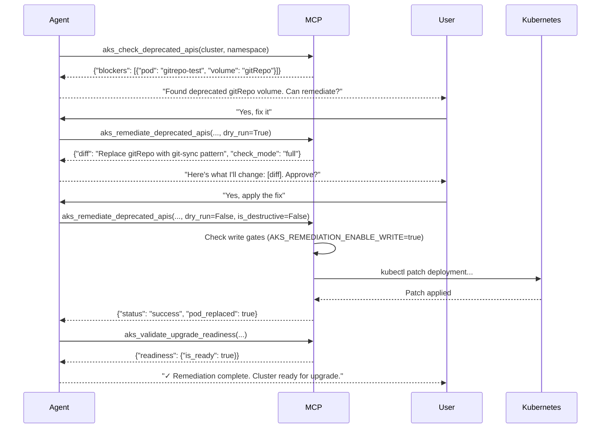
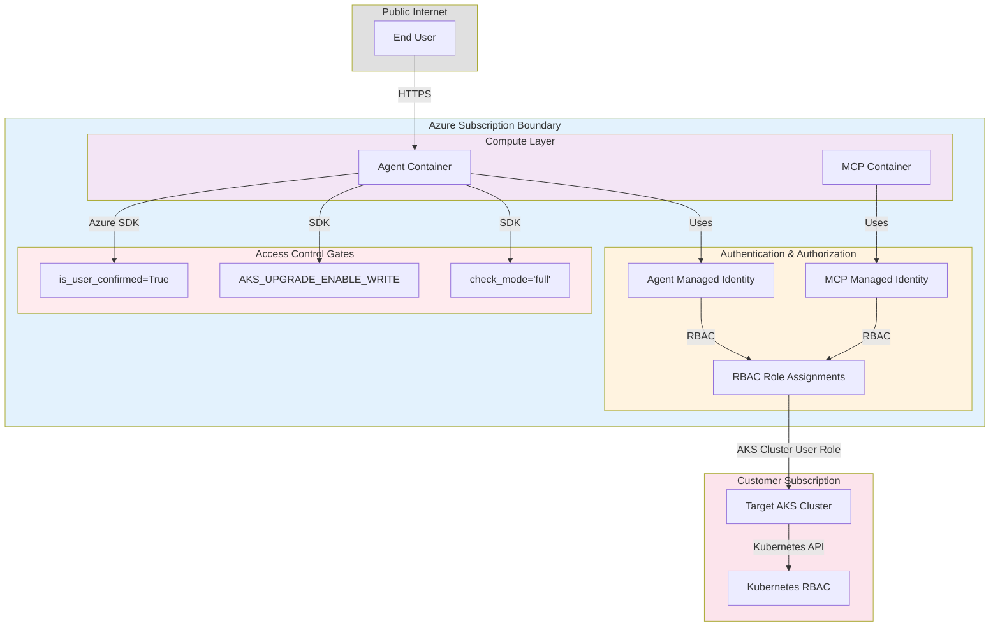
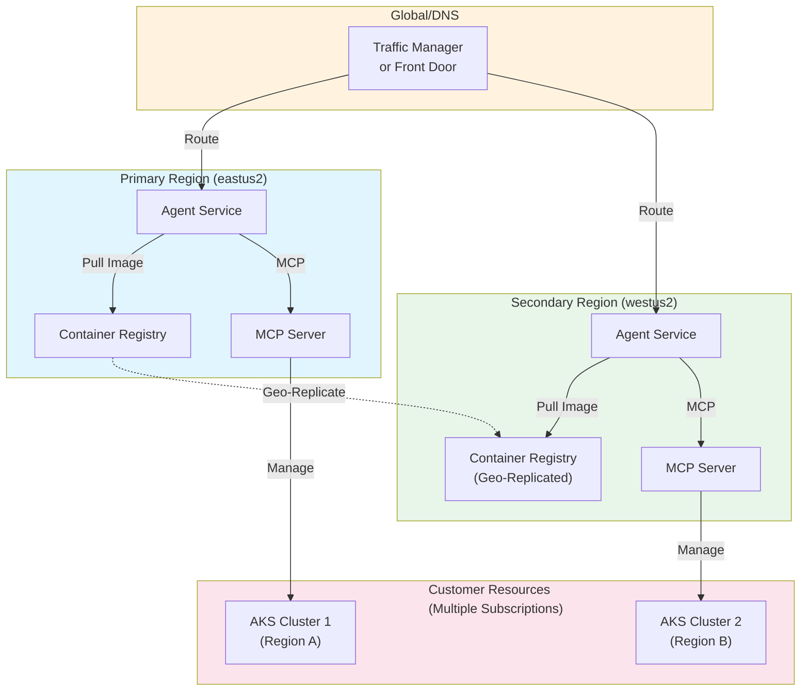

# 04 — Azure Architecture

## Solution Architecture Diagram

### High-Level Architecture (Logical)



### Detailed Component Architecture



### Data Flow Diagram



### Network Architecture

```mermaid
graph TB
    subgraph internet["Internet"]
        user["End User"]
    end
    
    subgraph azure_cloud["Azure Region (eastus2)"]
        subgraph vnet["Virtual Network\n(if using private endpoints)"]
            subnet1["Container Apps Subnet"]
            subnet2["Private Endpoint Subnet"]
        end
        
        subgraph azure_services["Azure Managed Services"]
            agent_svc["Foundry Agent Service\n(Public or Private)"]
            container_apps["Container App\n(aks-mcp)"]
            cog_service["Cognitive Services\n(Public or Private)"]
            openai["Azure OpenAI\n(Public or Private)"]
        end
        
        subgraph app_services["Application Infrastructure"]
            acr["Container Registry\n(Private, ACR Pull)"]
            logs["Log Analytics"]
            appinsights["Application Insights"]
        end
    end
    
    subgraph customer_azure["Customer's Azure (Separate Subscription)"]
        customer_aks["Target AKS Cluster"]
        customer_vnet["Customer VNet\n(if private)"]
    end
    
    user -->|Browser: HTTPS| agent_svc
    agent_svc -->|SDK/HTTP: HTTPS| openai
    agent_svc -->|MCP: HTTPS| container_apps
    container_apps -->|SDK: HTTPS| cog_service
    container_apps -->|kubectl: AKS Run Command| customer_aks
    
    container_apps -->|Image Pull: HTTPS| acr
    agent_svc -->|Logs| logs
    agent_svc -->|Traces| appinsights
    container_apps -->|Logs| logs
    
    container_apps -.->|Private Endpoint\n(Optional)| cog_service
    agent_svc -.->|Private Endpoint\n(Optional)| openai
    
    style internet fill:#e0e0e0
    style azure_cloud fill:#e3f2fd
    style vnet fill:#f5f5f5
    style azure_services fill:#fff3e0
    style app_services fill:#f3e5f5
    style customer_azure fill:#fce4ec
```

### Deployment Architecture (azd + Foundry)



## Architecture Patterns

### Pattern 1: Asynchronous Upgrade Execution



### Pattern 2: Staged Node-Pool Upgrade (complete_cluster)



### Pattern 3: Remediation with Explicit Approval



## Security Boundaries



## Multi-Region Considerations (Future)

For production deployments requiring multi-region capabilities:



---

**Next**: [05-agent-architecture.md](05-agent-architecture.md) for agent design  
**Status**: Production POC  
**Last Updated**: 2026-09-10
